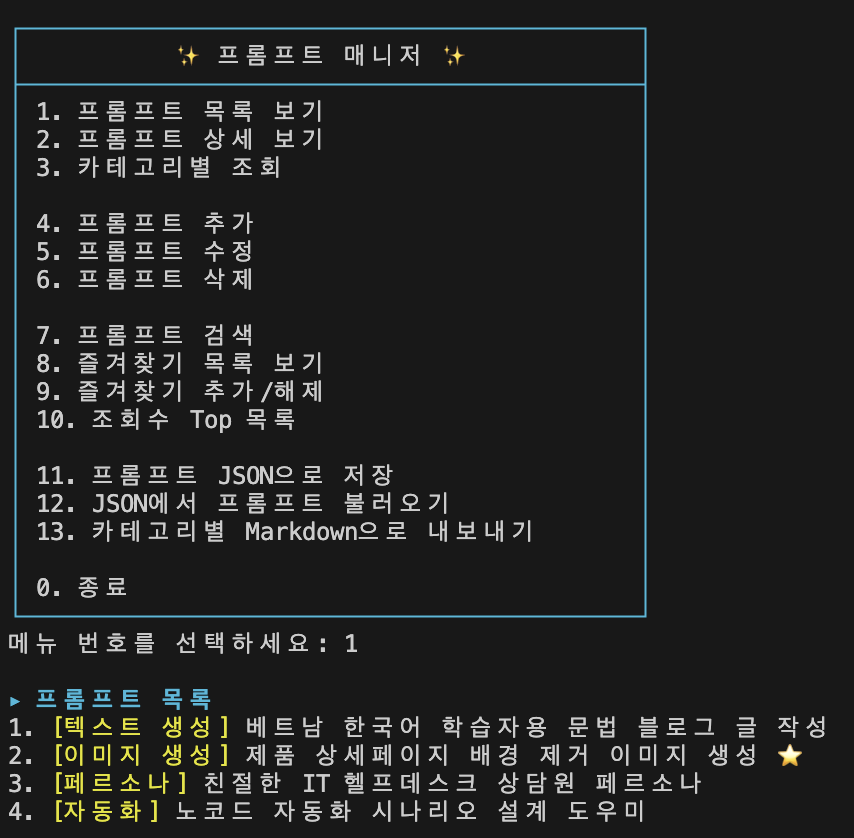
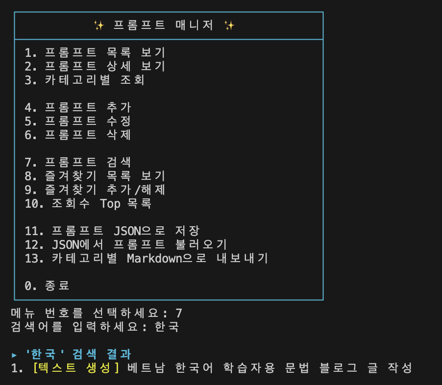
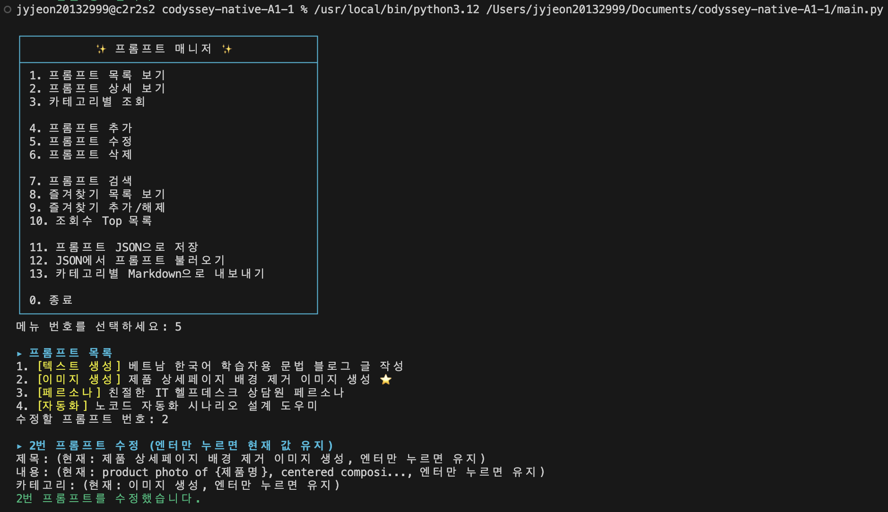
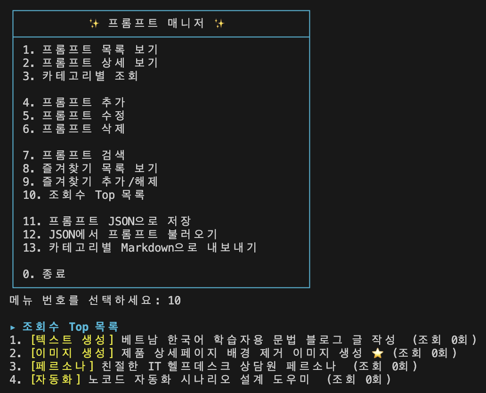
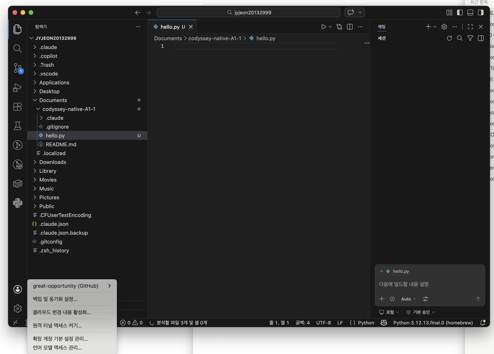
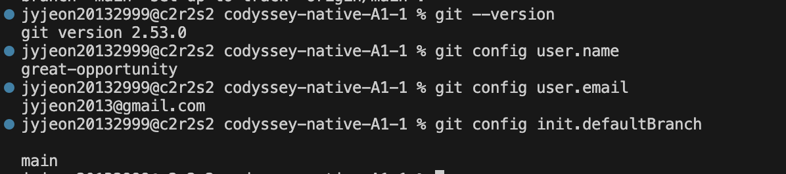
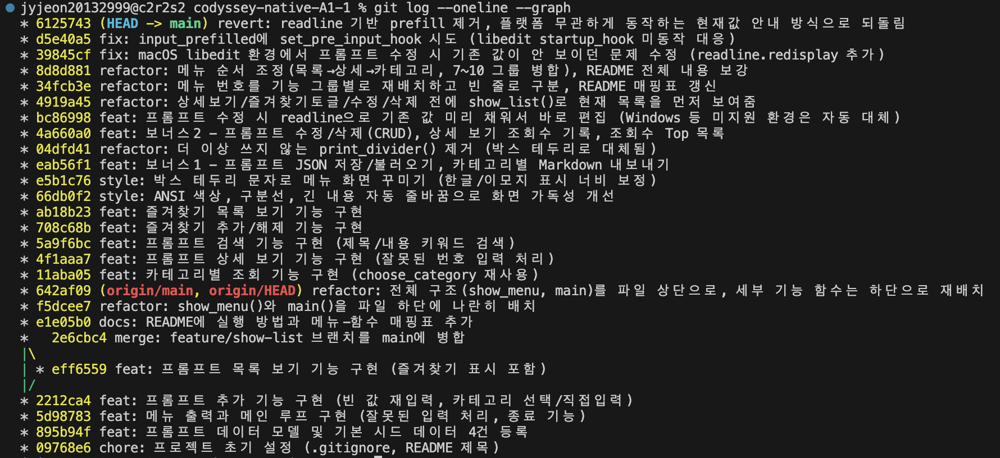

# 프롬프트 매니저 (Prompt Manager)

GenAI 미션들에서 쌓인 프롬프트를 한곳에서 등록·검색·즐겨찾기·관리할 수 있는 터미널 기반 콘솔 프로그램입니다. 메뉴 번호를 입력해 기능을 선택하는 방식으로 동작합니다.



## 실행 방법

```bash
python3 main.py
```

(Python 3.10 이상 필요. 예: `python3.12 main.py`)

## 기능 목록

**필수 기능**
- 프롬프트 목록 보기 / 상세 보기 / 카테고리별 조회
- 프롬프트 추가 (제목·내용·카테고리 입력, 빈 값 재입력 요구)
- 프롬프트 검색 (제목·내용 키워드)
- 즐겨찾기 추가/해제 및 즐겨찾기 목록 보기
- 잘못된 메뉴 번호 입력 시 안내 후 메뉴로 복귀

**보너스 기능**
- 프롬프트 수정 (기존 값이 입력창에 채워진 채로 바로 편집) / 삭제
- 상세 보기 시 조회수 자동 기록, 조회수 Top 목록
- 프롬프트를 JSON 파일로 저장 / JSON에서 불러오기
- 카테고리별 Markdown 파일로 내보내기

전체 메뉴 번호와 각 기능을 처리하는 함수는 아래와 같습니다.

| 번호 | 메뉴 | 담당 함수 |
|---|---|---|
| 1 | 프롬프트 목록 보기 | `show_list()` |
| 2 | 프롬프트 상세 보기 | `show_detail()` |
| 3 | 카테고리별 조회 | `show_by_category()` |
| 4 | 프롬프트 추가 | `add_prompt()` |
| 5 | 프롬프트 수정 (보너스) | `edit_prompt()` |
| 6 | 프롬프트 삭제 (보너스) | `delete_prompt()` |
| 7 | 프롬프트 검색 | `search_prompt()` |
| 8 | 즐겨찾기 목록 보기 | `show_favorites()` |
| 9 | 즐겨찾기 추가/해제 | `toggle_favorite()` |
| 10 | 조회수 Top 목록 (보너스) | `show_top_viewed()` |
| 11 | 프롬프트 JSON으로 저장 (보너스) | `save_to_json()` |
| 12 | JSON에서 프롬프트 불러오기 (보너스) | `load_from_json()` |
| 13 | 카테고리별 Markdown으로 내보내기 (보너스) | `export_to_markdown()` |
| 0 | 종료 | - |

그 외:
- `show_menu()` — 메뉴 화면 출력 (박스 테두리 + 기능 그룹별 구분)
- `choose_category()` — 카테고리 선택/직접입력 처리 (추가·카테고리별 조회에서 공용으로 사용)
- `input_prefilled()` — 수정 시 현재 값을 안내하고, 빈 입력이면 그대로 유지시켜주는 헬퍼
- `main()` — 전체 프로그램의 진입점 (메뉴 반복 출력 + 입력 분기)

## 카테고리

프롬프트를 추가할 때 아래 6개 카테고리 중 하나를 번호로 고르거나, 목록에 없으면 원하는 이름을 직접 입력할 수 있습니다.

| 카테고리 | 설명 |
|---|---|
| 텍스트 생성 | 블로그 글, 카피, 요약 등 텍스트 콘텐츠 생성용 프롬프트 |
| 이미지 생성 | Midjourney 등 이미지 생성 모델에 쓰는 키워드/프롬프트 |
| 영상 생성 | 영상 콘텐츠 제작용 프롬프트 |
| 페르소나 | 특정 역할/말투/성격을 부여하는 페르소나 설계 프롬프트 |
| 자동화 | Make, Zapier 등 노코드 자동화 시나리오 설계 프롬프트 |
| 기타 | 위 분류에 속하지 않는 프롬프트 |

## 데이터 유지 정책

- 프로그램 실행 중에 추가한 프롬프트와 즐겨찾기 상태는 메모리에 유지되며, **프로그램을 종료하면 초기화**됩니다.
- 다음 실행에도 데이터를 이어가고 싶다면, 종료 전에 메뉴 11(JSON 저장)로 저장해두고, 다시 실행한 뒤 메뉴 12(JSON 불러오기)로 불러오면 됩니다. 자동 저장/불러오기는 아닙니다.

## 실행 화면

**프롬프트 검색 (메뉴 7)**



**프롬프트 수정 (메뉴 5)**



**조회수 Top 목록 (메뉴 10)**



## 개발 환경

**VSCode + Python 3.12 + GitHub 계정 연동**



**Git 버전 및 사용자 설정**



## 커밋 히스토리

`git log --oneline --graph` 결과입니다. `feature/show-list` 브랜치를 만들어 목록 보기 기능을 작업한 뒤 `main`에 병합한 기록이 남아 있습니다.


