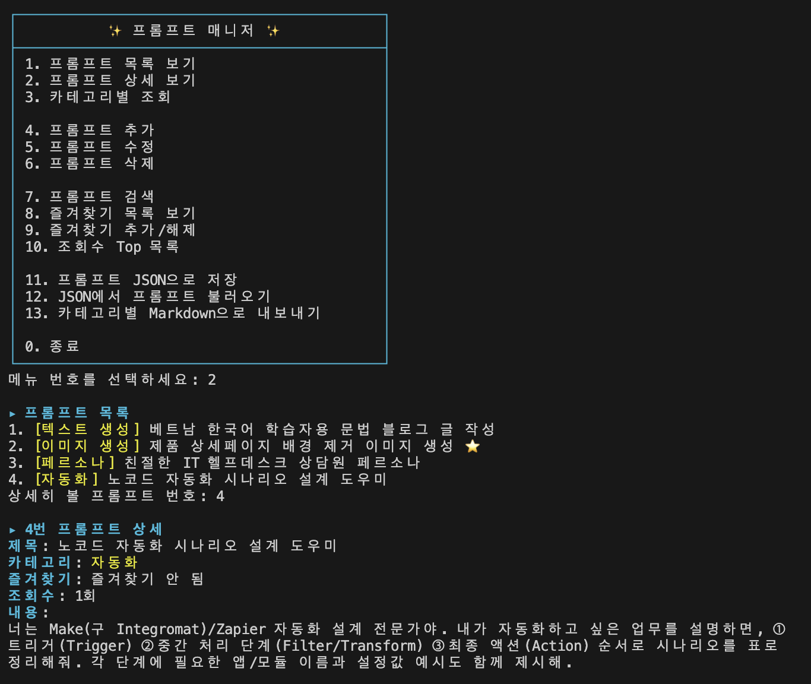
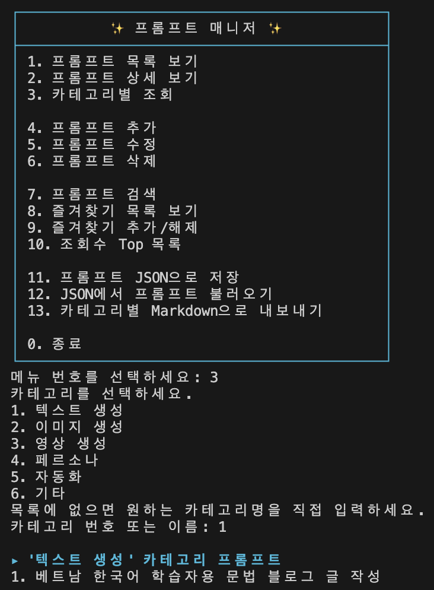
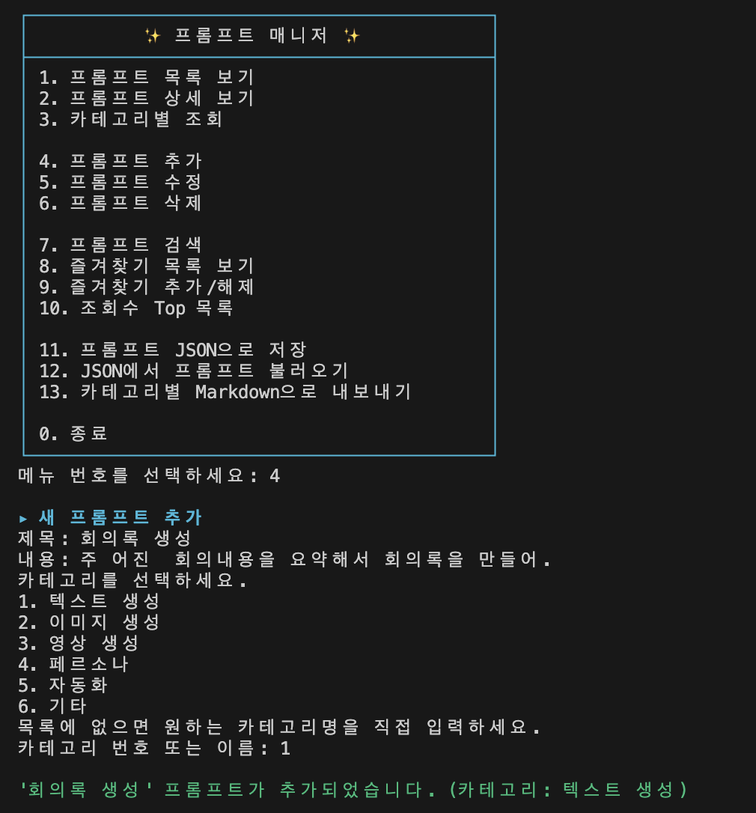
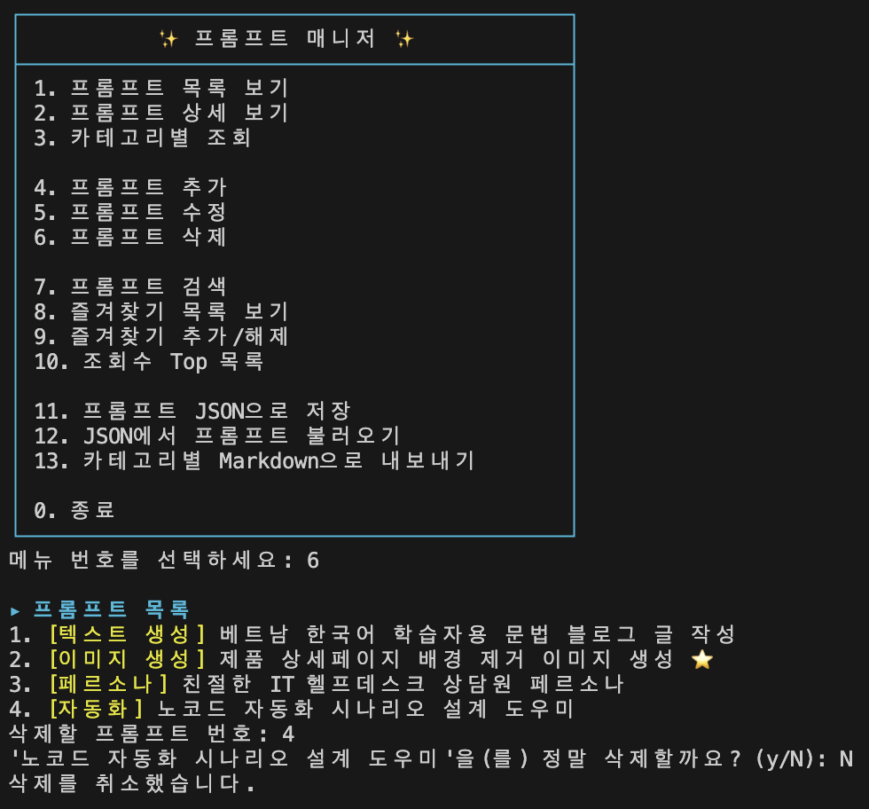
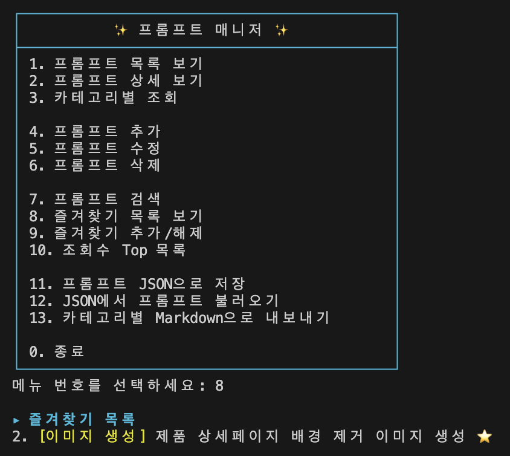

# 📝 프롬프트 매니저 (Prompt Manager)

GenAI 미션을 진행하며 메모장·노션·메신저에 흩어졌던 프롬프트를 한곳에서 관리하기 위해 만든 **파이썬 콘솔 프로그램**입니다.
터미널에서 메뉴 번호를 입력해 프롬프트를 등록·조회·검색·수정하고, 즐겨찾기와 조회수로 자주 쓰는 프롬프트를 빠르게 찾을 수 있습니다.


---

## 💻 1. 개발 환경

| 항목 | 내용 |
| :--- | :--- |
| 언어 | Python 3.12 (요구사항 3.10 이상 충족) |
| 사용 라이브러리 | 표준 라이브러리만 사용 — `json`, `os`, `textwrap`, `unicodedata` |
| 편집기 | Visual Studio Code (Python 확장, Korean Language Pack) |
| 버전 관리 | Git 2.53.0 / GitHub |
| 인코딩 | UTF-8 |

외부 라이브러리(`pip install`)는 전혀 사용하지 않았습니다.

**VSCode + Python 인터프리터 + GitHub 계정 연동**


**Git 버전 및 사용자 설정**


---

## ⚡ 2. 실행 방법

터미널에서 프로젝트 폴더로 이동한 뒤 아래 명령을 실행합니다.

```bash
python3 main.py
```

Python 3.10 이상이 필요합니다. 시스템 기본 파이썬이 3.9 이하라면 버전을 지정해 실행하세요.

```bash
python3.12 main.py
```

실행하면 메뉴가 출력되고, 번호를 입력해 기능을 선택합니다. 각 기능이 끝나면 다시 메뉴로 돌아오며, 잘못된 번호를 입력하면 안내 메시지를 출력한 뒤 메뉴를 다시 보여줍니다. `0`을 입력하면 종료됩니다.

---

## 🛠️ 3. 기능 목록

### 📌 필수 요구사항 구현

| 메뉴 | 기능명 | 상세 내용 |
| :---: | :--- | :--- |
| **1** | 프롬프트 목록 보기 | 저장된 전체 프롬프트를 번호·카테고리·제목·즐겨찾기(⭐)와 함께 출력합니다. 프롬프트가 없으면 안내 메시지를 보여줍니다. |
| **2** | 프롬프트 상세 보기 | 번호를 입력하면 제목·카테고리·즐겨찾기 여부·조회수·내용 전문을 출력합니다. 긴 내용은 터미널 폭에 맞춰 자동 줄바꿈됩니다. |
| **3** | 카테고리별 조회 | 카테고리를 고르면 해당 카테고리의 프롬프트만 필터링해 보여줍니다. 결과가 없으면 안내 메시지를 출력합니다. |
| **4** | 프롬프트 추가 | 제목·내용·카테고리를 입력받아 새 프롬프트를 등록합니다. 빈 값을 입력하면 다시 입력을 요청합니다. |
| **7** | 프롬프트 검색 | 키워드를 입력하면 제목 또는 내용에 그 키워드가 포함된 프롬프트를 찾습니다. 대소문자를 구분하지 않습니다. |
| **8** | 즐겨찾기 목록 보기 | 즐겨찾기로 지정한 프롬프트만 모아서 보여줍니다. |
| **9** | 즐겨찾기 추가/해제 | 번호를 입력해 해당 프롬프트의 즐겨찾기 상태를 토글합니다. |
| **0** | 종료 | 반복 루프를 빠져나와 프로그램을 종료합니다. |

### 🚀 보너스 요구사항 구현

| 메뉴 | 기능명 | 상세 내용 |
| :---: | :--- | :--- |
| **5** | 프롬프트 수정 | 제목·내용·카테고리를 개별 수정합니다. 현재 값을 안내해주고, 엔터만 누르면 기존 값을 그대로 유지합니다. |
| **6** | 프롬프트 삭제 | 번호로 프롬프트를 삭제합니다. 실수를 막기 위해 삭제 전 `y/N` 확인 절차를 거칩니다. |
| **10** | 조회수 Top 목록 | 상세 보기(2번)를 실행할 때마다 누적되는 조회수를 기준으로 내림차순 정렬해 보여줍니다. |
| **11** | JSON으로 저장 | 현재 프롬프트 전체를 `data/prompts.json`에 저장합니다. 한글이 그대로 보이도록 저장합니다. |
| **12** | JSON에서 불러오기 | 저장해둔 JSON 파일을 읽어 현재 프롬프트 목록을 교체합니다. |
| **13** | 카테고리별 Markdown 내보내기 | 프롬프트를 카테고리별로 묶어 `exports/` 폴더에 카테고리마다 하나씩 `.md` 파일로 내보냅니다. |

메뉴는 성격이 비슷한 기능끼리 묶어 빈 줄로 구분해 배치했습니다. (조회 → 편집 → 검색/즐겨찾기/통계 → 파일 입출력 → 종료)

---

## 📖 4. 기능별 사용 설명

### 1. 프롬프트 목록 보기

전체 프롬프트를 `번호. [카테고리] 제목 ⭐` 형태로 출력합니다. 여기 표시되는 번호는 상세 보기·수정·삭제·즐겨찾기에서 그대로 사용하는 기준 번호입니다.

### 2. 프롬프트 상세 보기

목록을 먼저 보여준 뒤 번호를 입력받습니다. 숫자가 아니거나 범위를 벗어난 번호를 넣으면 안내 메시지를 출력하고 메뉴로 돌아갑니다.
조회할 때마다 해당 프롬프트의 `views`(조회수)가 1씩 증가하며, 이 값은 10번 메뉴(조회수 Top 목록)에 반영됩니다.



### 3. 카테고리별 조회

미리 정의된 카테고리 목록을 보여주고, 번호를 고르거나 이름을 직접 입력받습니다. 출력되는 번호는 전체 목록 기준 번호를 그대로 유지하므로, 여기서 본 번호로 바로 상세 보기를 할 수 있습니다.



### 4. 프롬프트 추가

제목 → 내용 → 카테고리 순으로 입력받습니다. 제목이나 내용이 비어 있으면(공백만 입력한 경우 포함) 다시 입력을 요청합니다. 카테고리는 목록에서 번호로 고르거나, 목록에 없는 이름을 직접 입력할 수도 있습니다. 즐겨찾기 기본값은 `False`, 조회수 기본값은 `0`입니다.



### 5. 프롬프트 수정

목록을 보여준 뒤 수정할 번호를 입력받고, 제목·내용·카테고리를 차례로 묻습니다. 각 항목의 현재 값을 괄호 안에 안내해주며, 엔터만 누르면 그 값을 그대로 유지합니다. 내용이 긴 경우 안내 문구에는 앞부분만 잘라서 보여주지만, 실제로 유지되는 값은 원본 전체입니다.


### 6. 프롬프트 삭제

삭제할 번호를 입력하면 `'제목'을(를) 정말 삭제할까요? (y/N)` 확인을 거칩니다. `y`를 입력한 경우에만 삭제되고, 그 외의 입력은 취소로 처리합니다.



### 7. 프롬프트 검색

검색어를 입력받아 제목과 내용을 모두 검사합니다. 양쪽을 소문자로 변환한 뒤 `in` 연산자로 포함 여부를 확인하므로 대소문자를 구분하지 않습니다. 결과가 없으면 안내 메시지를 출력합니다.


### 8~9. 즐겨찾기

9번으로 프롬프트의 즐겨찾기 상태를 켜고 끌 수 있으며, 8번으로 즐겨찾기된 항목만 모아 볼 수 있습니다. 즐겨찾기된 프롬프트는 모든 목록에서 ⭐로 표시됩니다.



### 10. 조회수 Top 목록

상세 보기에서 누적된 조회수를 기준으로 정렬해 전체 프롬프트를 보여주며, 각 항목 옆에 조회 횟수를 함께 표시합니다.


### 11~13. 파일 입출력

11번으로 저장하면 `data/prompts.json`이 생성되고, 12번으로 그 파일을 다시 불러올 수 있습니다. 13번은 카테고리별로 `exports/텍스트 생성.md`처럼 파일을 나눠 생성합니다.

---

## 🗂️ 5. 데이터 구조

프롬프트는 **리스트 안의 딕셔너리** 형태로 저장합니다.

```python
prompts = [
    {
        "title": "베트남 한국어 학습자용 문법 블로그 글 작성",
        "content": "너는 베트남인 한국어 학습자를 위한 블로그의 전문 필진이야. ...",
        "category": "텍스트 생성",
        "favorite": False,
        "views": 0,
    },
    ...
]
```

| 필드 | 타입 | 설명 |
| :--- | :--- | :--- |
| `title` | 문자열 | 프롬프트 제목 |
| `content` | 문자열 | 프롬프트 본문 전체 |
| `category` | 문자열 | 아래 카테고리 중 하나 (또는 직접 입력한 이름) |
| `favorite` | 불리언 | 즐겨찾기 여부 (기본값 `False`) |
| `views` | 정수 | 상세 보기 누적 횟수 (기본값 `0`, 보너스 기능) |

리스트는 순서대로 번호를 매겨 접근하기 좋고, 딕셔너리는 `prompt["title"]`처럼 의미 있는 이름으로 값을 꺼낼 수 있어 두 구조를 결합했습니다.

### 카테고리

프롬프트 추가·조회 시 아래 6개 중에서 번호로 고르거나, 목록에 없는 이름을 직접 입력할 수 있습니다.

| 카테고리 | 설명 |
| :--- | :--- |
| 텍스트 생성 | 블로그 글, 카피, 요약 등 텍스트 콘텐츠 생성용 프롬프트 |
| 이미지 생성 | Midjourney 등 이미지 생성 모델에 쓰는 키워드/프롬프트 |
| 영상 생성 | 영상 콘텐츠 제작용 프롬프트 |
| 페르소나 | 특정 역할·말투·성격을 부여하는 페르소나 설계 프롬프트 |
| 자동화 | Make, Zapier 등 노코드 자동화 시나리오 설계 프롬프트 |
| 기타 | 위 분류에 속하지 않는 프롬프트 |

### 기본 등록 프롬프트

이전 미션에서 작성한 프롬프트를 포함해 4건이 프로그램 시작 시 기본으로 등록되어 있습니다.

1. **베트남 한국어 학습자용 문법 블로그 글 작성** (텍스트 생성) — 이전 미션에서 실제로 사용한 프롬프트
2. **제품 상세페이지 배경 제거 이미지 생성** (이미지 생성)
3. **친절한 IT 헬프데스크 상담원 페르소나** (페르소나)
4. **노코드 자동화 시나리오 설계 도우미** (자동화)

### 데이터 유지 정책

- 실행 중에 추가·수정한 내용과 즐겨찾기 상태는 메모리에 유지되며, **프로그램을 종료하면 초기화**됩니다. (과제 요구사항)
- 다음 실행에도 데이터를 이어가려면 종료 전에 **11번(JSON 저장)** 을 실행하고, 다시 실행한 뒤 **12번(JSON 불러오기)** 으로 복원합니다. 자동 저장·자동 불러오기는 하지 않습니다.

---

## 🧩 6. 코드 구조

모든 기능을 한 함수에 몰아넣지 않고 역할별로 함수를 분리했습니다. 파일 상단에 데이터와 전체 흐름(`show_menu`, `main`)을 두고, 그 아래에 세부 기능 함수를 배치해 큰 그림부터 읽히도록 구성했습니다.

**전체 구조**

| 함수 | 역할 |
| :--- | :--- |
| `main()` | 진입점. 메뉴를 반복 출력하고 입력한 번호에 따라 기능 함수를 호출 |
| `show_menu()` | 메뉴 화면 출력 (박스 테두리 + 기능 그룹별 구분) |

**기능 함수**

| 함수 | 담당 메뉴 |
| :--- | :--- |
| `show_list()` | 1. 프롬프트 목록 보기 |
| `show_detail()` | 2. 프롬프트 상세 보기 |
| `show_by_category()` | 3. 카테고리별 조회 |
| `add_prompt()` | 4. 프롬프트 추가 |
| `edit_prompt()` | 5. 프롬프트 수정 |
| `delete_prompt()` | 6. 프롬프트 삭제 |
| `search_prompt()` | 7. 프롬프트 검색 |
| `show_favorites()` | 8. 즐겨찾기 목록 보기 |
| `toggle_favorite()` | 9. 즐겨찾기 추가/해제 |
| `show_top_viewed()` | 10. 조회수 Top 목록 |
| `save_to_json()` | 11. JSON으로 저장 |
| `load_from_json()` | 12. JSON에서 불러오기 |
| `export_to_markdown()` | 13. 카테고리별 Markdown 내보내기 |

**공용 도우미 함수**

| 함수 | 역할 |
| :--- | :--- |
| `choose_category()` | 카테고리 선택/직접입력 처리 (추가·카테고리별 조회에서 공용 사용) |
| `input_prefilled()` | 수정 시 현재 값을 안내하고, 빈 입력이면 기존 값을 유지 |
| `format_item()` | 목록 한 줄(`번호. [카테고리] 제목 ⭐`)을 만드는 공통 포맷터 |
| `print_section()` / `print_error()` / `print_success()` | 섹션 제목·오류·성공 메시지를 일관된 색상으로 출력 |
| `print_wrapped()` | 긴 내용을 문단 구분은 유지한 채 터미널 폭에 맞춰 줄바꿈 |
| `print_box_line()` / `print_box_border()` | 메뉴 상자 테두리 출력 |
| `display_width()` | 한글·이모지의 실제 표시 너비(2칸)를 계산해 테두리가 어긋나지 않게 보정 |

화면 꾸미기에는 ANSI 이스케이프 코드(색상)와 유니코드 박스 문자를 사용했습니다. 한글은 터미널에서 영문자의 2배 폭을 차지하기 때문에, `unicodedata.east_asian_width()`로 각 글자의 폭을 판별해 상자 오른쪽 테두리가 어긋나지 않도록 처리했습니다.

---

## 🌿 7. Git 버전 관리 이력

기능 단위로 커밋을 나눠 진행했으며, **프롬프트 목록 보기 기능**은 `feature/show-list` 브랜치를 만들어 작업한 뒤 `main`에 병합했습니다. 병합할 때는 `--no-ff` 옵션을 사용해 브랜치가 갈라졌다 합쳐진 기록이 그래프에 남도록 했습니다.

```bash
git checkout -b feature/show-list          # 브랜치 생성 후 이동
# ... 목록 보기 기능 구현 및 커밋 ...
git checkout main                          # main으로 복귀
git merge --no-ff feature/show-list        # 병합 커밋을 남기며 병합
git branch -d feature/show-list            # 병합 완료된 브랜치 정리
```

### 📊 커밋 로그 그래프


```text
*   2e6cbc4 merge: feature/show-list 브랜치를 main에 병합
|\
| * eff6559 feat: 프롬프트 목록 보기 기능 구현 (즐겨찾기 표시 포함)
|/
* 2212ca4 feat: 프롬프트 추가 기능 구현 (빈 값 재입력, 카테고리 선택/직접입력)
* 5d98783 feat: 메뉴 출력과 메인 루프 구현 (잘못된 입력 처리, 종료 기능)
* 895b94f feat: 프롬프트 데이터 모델 및 기본 시드 데이터 4건 등록
* 09768e6 chore: 프로젝트 초기 설정 (.gitignore, README 제목)
```

커밋 메시지는 변경 의도가 드러나도록 `feat`(기능 추가), `fix`(버그 수정), `refactor`(동작 변경 없는 구조 개선), `style`(화면·서식), `docs`(문서), `chore`(설정) 접두어를 붙여 작성했습니다.

### 🧰 사용한 Git 명령어

| 명령어 | 이 프로젝트에서 한 일 |
| :--- | :--- |
| `git init` | 프로젝트 폴더를 로컬 저장소로 초기화 |
| `git add` | 변경한 파일을 스테이징 영역에 추가 |
| `git commit` | 기능 단위로 의미 있는 변경을 기록 |
| `git push` | 로컬 커밋을 GitHub 원격 저장소에 업로드 |
| `git pull` | 원격 저장소의 변경 내용을 로컬에 반영 |
| `git checkout` | `feature/show-list` 브랜치 생성·이동 및 `main` 복귀 |
| `git merge` | 브랜치 작업 내용을 `main`에 병합 (`--no-ff`) |
| `git clone` | 공개 샘플 저장소(`octocat/Hello-World`)를 복제해 폴더 구조와 로그 확인 |

`git clone` 실습에서는 아래처럼 공개 저장소를 내려받아 폴더 구조와 커밋 이력을 확인했습니다. 병합 커밋이 포함된 그래프를 실제로 관찰할 수 있었고, 확인 후 삭제했습니다.

```bash
git clone https://github.com/octocat/Hello-World.git
cd Hello-World
git log --oneline --graph --all
```

---

## 📚 8. 용어 정리

프로젝트를 진행하며 익힌 개념을 정리했습니다.

**Git 관련**

- **Git** — 파일의 변경 이력을 시점별로 기록하고 되돌릴 수 있게 해주는 버전 관리 도구입니다. "언제, 누가, 왜 바꿨는지"가 남기 때문에 실수한 지점으로 되돌아가거나 여러 작업을 병행할 수 있습니다.
- **브랜치(branch)** — 커밋 하나를 가리키는 이름표입니다. 파일을 복사하는 것이 아니라 포인터를 옮기는 개념이라 가볍고 빠릅니다. 새 브랜치에서 커밋하면 그 브랜치 이름표만 이동하고 `main`은 그대로 남습니다.
- **merge / fast-forward** — `main`이 브랜치를 만든 이후 움직이지 않았다면 Git은 병합 커밋 없이 이름표만 앞으로 옮깁니다(fast-forward). 이 경우 브랜치를 썼던 흔적이 로그에 남지 않기 때문에, `--no-ff` 옵션으로 병합 커밋을 강제로 만들어 이력을 남겼습니다.
- **origin / `-u` 옵션** — `origin`은 원격 저장소 주소에 붙인 별명이고, `git push -u origin main`의 `-u`는 로컬 `main`과 원격 `origin/main`을 연결(추적)해 이후부터 `git push`만으로 동작하게 만듭니다.
- **push / pull** — `push`는 로컬 커밋을 원격으로 올리는 것, `pull`은 원격의 변경 사항을 로컬로 내려받는 것입니다.

**Python 관련**

- **리스트 컴프리헨션** — `[(i, p) for i, p in enumerate(prompts, start=1) if 조건]` 형태로, 반복·조건 필터링·새 리스트 생성을 한 줄로 처리하는 문법입니다. 카테고리별 조회·검색·즐겨찾기 목록에서 사용했습니다.
- **`enumerate(리스트, start=1)`** — 반복하면서 "몇 번째인지"와 "그 항목"을 함께 돌려줍니다. 사용자에게 보여줄 번호를 1부터 매기기 위해 `start=1`을 지정했습니다.
- **`global` 키워드** — 함수 안에서 전역 변수에 **새로 대입**할 때 필요합니다. `prompts.append(...)`처럼 기존 객체의 내용만 바꿀 때는 필요 없지만, `load_from_json()`처럼 `prompts = json.load(f)`로 이름 자체를 새 리스트에 다시 묶을 때는 `global prompts` 선언이 필요합니다.
- **`with open(...) as f`** — 블록이 끝나면 파일을 자동으로 닫아주는 구문입니다. 중간에 오류가 나도 닫히므로 파일이 열린 채 남는 실수를 막아줍니다.
- **`.strip()`** — 입력값 앞뒤의 공백·줄바꿈을 제거합니다. 공백만 입력한 경우를 빈 값으로 판정하기 위해 모든 `input()`에 함께 사용했습니다.
- **독스트링(docstring)** — 함수 첫 줄에 `"""..."""`로 적는 설명문입니다. 일반 주석(`#`)과 달리 프로그램이 값으로 저장하며, `help(함수명)`으로 확인할 수 있습니다.
- **`if __name__ == "__main__":`** — 이 파일을 직접 실행했을 때만 `main()`을 호출하도록 하는 구문입니다. 다른 파일에서 `import`할 때는 자동 실행되지 않습니다.

---

## 📁 9. 폴더 구조

```text
codyssey-native-A1-1/
├── main.py              # 프로그램 본체 (전체 기능 구현)
├── README.md            # 프로젝트 설명 문서
├── .gitignore           # Git 추적 제외 목록
├── screenshot/          # 제출용 스크린샷
├── data/                # 11번 메뉴 실행 시 생성 (prompts.json) — Git 추적 제외
└── exports/             # 13번 메뉴 실행 시 생성 (카테고리별 .md) — Git 추적 제외
```

`data/`와 `exports/`는 프로그램 실행 중에 생성되는 결과물이므로 `.gitignore`에 등록해 저장소에는 포함하지 않았습니다.
